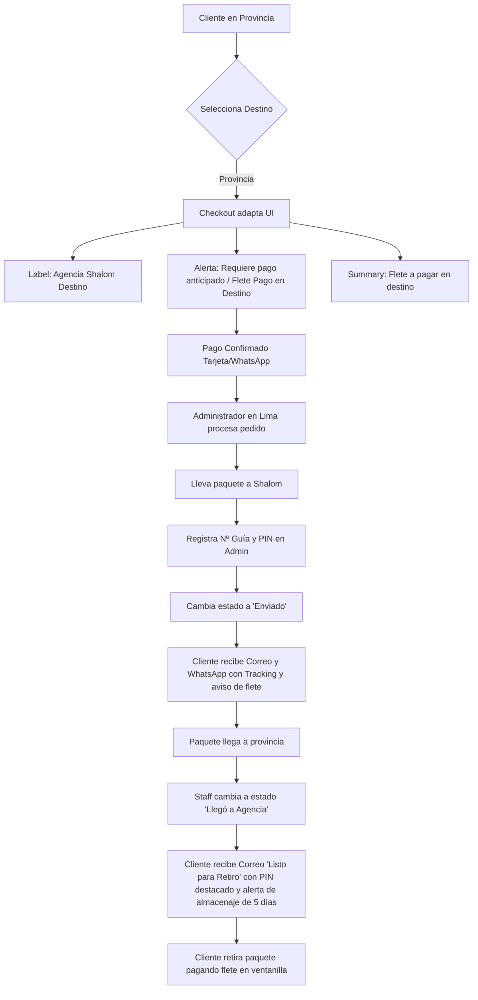

# 📦 Análisis Técnico y Logístico: Optimización de Envíos a Provincia (Tienda Blama 2026)

Este documento presenta un diagnóstico profundo de las operaciones de envío desde **Lima hacia Provincias** (vía agencias como Shalom u Olva Courier) e identifica los casos de falla operativos, proponiendo mejoras específicas a nivel de interfaz de usuario, flujos de base de datos, correos transaccionales y mensajería de WhatsApp.

---

## 🔍 Contexto Operativo
Toda la infraestructura y almacenamiento de **Tienda Blama** está centralizada en **Lima**. 
*   **Envíos en Lima**: Se realizan de forma directa a domicilio del cliente con soporte de contraentrega.
*   **Envíos a Provincia**: Se realizan casi de forma exclusiva para **retiro en oficina o agencia física** (principalmente **Shalom**), debido a los altos costos y la falta de cobertura confiable de reparto a domicilio en zonas rurales o alejadas del país.

---

## ⚡ Casos de Falla Identificados & Propuestas de Solución

### Caso 1: Claridad de Envío a Agencia en Provincia sin Fricción en el Checkout
*   **El Desafío**: El cliente de provincia ingresa su dirección domiciliaria normal (Calle/Número/Referencia) porque es el dato que conoce de memoria. Intentar cambiar los campos o forzarlo a que busque e ingrese la dirección exacta de la agencia física de Shalom en su ciudad causaría una enorme fricción, errores de digitación o el abandono completo del checkout (ya que la mayoría no sabe las direcciones de las agencias de memoria).
*   **La Solución Operativa (Alineación Sin Fricción)**:
    *   **Mantener el Formulario Tradicional**: El cliente seguirá completando su dirección domiciliaria normal (Calle, Número, Distrito, Provincia) usando el autocompletado de Google Maps o de forma manual, exactamente igual que siempre. Esto garantiza un checkout súper fluido y con cero fricción de compra.
    *   **Banner Informativo Amigable**: Cuando se seleccione "Provincia" como método de envío, mostraremos un cuadro de información muy amigable e instructivo en la sección de dirección:
        > 💡 **Envíos a Provincia**: Todos los paquetes se envían para retiro en la oficina o agencia principal de Shalom de tu distrito o ciudad.
    *   **Selección del Staff**: El staff de ventas, al recibir el pedido y coordinar el pago, seleccionará la oficina de Shalom ideal para el cliente o le sugerirá la más cercana usando la dirección ingresada, evitando que el cliente tenga que investigarlo por sí mismo en el checkout.

---

### Caso 2: El Costo del Flete en Provincia (Flete Pago en Destino)
*   **El Problema**: Actualmente, el checkout de provincia muestra el texto `"Precio a calcular"` en el resumen de envío. Sin embargo, no se aclara quién, cuándo ni cómo se paga ese flete, induciendo a error al cliente (algunos creen que la tienda los llamará para cobrarles por transferencia antes de enviar, otros creen que es gratis).
*   **Mitigación en Frontend (Checkout & WhatsApp)**:
    *   En el componente de resumen de compra ([CheckoutSummary](file:///c:/Users/Administrador/Desktop/PROYECTOS/Tienda-Blama-2026/features/checkout/components/checkout-summary.tsx)), cuando el método sea "Provincia", reemplazaremos el texto `"Precio a calcular"` por un badge estilizado: **`"Flete por Pagar en Destino (Agencia)"`**.
    *   En el mensaje final de WhatsApp, se añadirá explícitamente la nota: *«El costo del envío (Flete) lo cobra directamente la agencia al momento del retiro del paquete.»*

---

### Caso 3: Flujo Flexible de Pagos en Provincia (Coordinación CRM & Recaudo Shalom)
*   **Enfoque Flexible**: En los envíos a provincia, la forma definitiva de pago **no es rígida**. El checkout es un punto de inicio; la decisión final sobre las condiciones de pago (si el cliente paga el **100% por adelantado**, si hace un **pago parcial/adelanto** de flete de S/ 15, o si opta por **pago total contraentrega en la ventanilla de Shalom**) la define el staff administrativo en el panel de control conversando directamente con el cliente a través de WhatsApp.
*   **Mitigación en Frontend (Checkout)**:
    *   Mantendremos todas las opciones de pago habilitadas y abiertas para dar máxima versatilidad al cliente.
    *   **Mensaje Informativo de Ayuda**: Si el usuario selecciona el método de envío **"Provincia"**, mostraremos un bloque de información destacado de color azul claro/gris sumamente vistoso debajo de la selección de métodos de pago:
        > 💡 **Información de Envío a Provincia**:
        > * **Lugar de entrega**: Los paquetes se envían a la oficina principal de Shalom de tu ciudad.
        > * **Opciones de Pago Flexibles**: Puedes pagar tu pedido por adelantado, dar un adelanto, o pagar el total contraentrega directamente en la ventanilla de la agencia Shalom de tu ciudad al momento de recoger tu paquete. 
        > * **Coordinación**: Un asesor se pondrá en contacto contigo por WhatsApp tras finalizar el pedido para coordinar juntos la forma de pago que te resulte más cómoda.
*   **Gestión en el Panel Administrativo (CRM)**:
    *   Los asesores de venta podrán modificar manualmente el estado del pedido, el estado del pago (`Pago Parcial`, `Pagado Anticipado`, `Pago Contraentrega`) y los montos correspondientes en la ficha administrativa del pedido según lo conversado con el cliente por WhatsApp.

---

### Caso 4: Intentos de Evasión de Tarifa de Provincia (Estratagema "Lima-Falso")
*   **El Problema**: Clientes que viven en provincia (ej: Piura) y llenan su dirección como "Piura, Piura, Piura" pero en el selector de método de envío marcan "Lima" para aprovechar la oferta de "Envío Gratis a Domicilio" del sistema. Esto causa problemas de control de costos en el CRM.
*   **Mitigación en Frontend (Checkout)**:
    *   **Alineación Automática**: En el flujo del formulario, si el campo autocompletado de **Departamento** no es *"Lima"* (o *"Callao"*), y el usuario intenta seleccionar el método de envío *"Lima"*, el formulario re-ajustará automáticamente el método de envío a *"Provincia"* mostrando un aviso Toast correctivo:
        > 📍 **Ajuste de Cobertura**: Detectamos que tu dirección está en **${departamento}**. El método de envío se ha configurado automáticamente a **Provincia**.

---

### Caso 5: Paquetes Olvidados en la Agencia de Destino
*   **El Problema**: El paquete llega a la agencia en provincia y queda listo para retiro. Sin embargo, Shalom no siempre avisa al cliente con efectividad. Si el cliente no lo recoge en **5 días hábiles**, la agencia empieza a cobrar costos de almacenaje diarios por paquete custodiado, y después de 15 días lo devuelve a Lima, resultando en pérdidas netas de fletes de ida y vuelta para la tienda.
*   **Mitigación en el CRM y Notificaciones**:
    *   **Nuevo Estado de Pedido**: Crear un nuevo estado en la base de datos de Supabase llamado `"Listo para Retiro"` o `"Llegó a Agencia"`.
    *   **Correo Automatizado de Retiro**: Cuando el staff administrativo marque el pedido como `"Llegó a Agencia"`, el sistema enviará automáticamente un correo interactivo premium con el asunto:
        > `¡Tu pedido ${pedidoId} ya está listo para retirar en la agencia! 📦 - Blama Shop`
    *   **Contenido del Correo**:
        *   Dirección exacta y nombre de la agencia de destino.
        *   **PIN de retiro Shalom de 4 dígitos** destacado visualmente en un bloque interactivo verde.
        *   Alerta urgente informando que tiene un plazo máximo de **5 días** para retirar el paquete antes de que la agencia aplique recargos por almacenaje.
        *   Un botón interactivo para abrir la ubicación de la agencia en Google Maps.

---

### Caso 6: Cliente de Lima que Solicita Retiro en Agencia Shalom
*   **La Situación**: Un cliente vive en Lima Metropolitana, pero debido a su trabajo, horarios complicados o por vivir en una zona con reparto complejo, prefiere **no recibir el pedido en su domicilio**. Solicita retirar su paquete en una oficina física de Shalom en Lima (ej: *Shalom Los Olivos*, *Shalom San Juan de Lurigancho*).
*   **La Solución Operativa (Checkout & CRM)**:
    *   **En el Checkout**: Cuando el cliente seleccione el método de envío **"Lima"**, daremos la flexibilidad de que en la dirección domiciliaria ingrese la referencia normal.
    *   **En la Coordinación por WhatsApp**: Si el cliente menciona que prefiere recoger en una oficina física de Shalom de Lima Metropolitana, el staff administrativo en el panel de administración simplemente cambiará internamente el courier a **Shalom (Lima)**.
    *   **En el CRM**: El sistema tratará el pedido con las mismas lógicas automáticas y seguras de Shalom (solicitando PIN de retiro, permitiendo cambios a `"Llegó a Agencia"` y bloqueando el PIN por correo en caso de saldos pendientes), garantizando que el paquete en la oficina de Lima esté custodiado y no se entregue sin cobrar el saldo.

---

### Caso 7: Cliente de Provincia que Solicita Entrega a Domicilio (Olva Courier)
*   **La Situación**: Un cliente de provincia **no desea ir a recoger a la oficina de Shalom** y está dispuesto a pagar un costo de envío adicional por adelantado para que su paquete le llegue a la puerta de su casa en su región a través de **Olva Courier**.
*   **La Solución Operativa (CRM & Despachador de Correos)**:
    *   **Coordinación de Tarifa**: El staff de ventas calcula la tarifa exacta a domicilio de Olva por WhatsApp y el cliente realiza la transferencia del total (productos + flete Olva).
    *   **Gestión en el Panel Administrativo (CRM)**: El trabajador cambia el método de envío a **"Olva Courier (A Domicilio)"** en el CRM y marca el estado de pago como `"Pagado"`.
    *   **Despacho y Notificaciones**:
        *   Cuando el pedido se marca como `"Enviado"`, el sistema detecta que el courier es Olva Courier.
        *   **El correo transaccional se adapta dinámicamente**: oculta todo el bloque del "PIN de Shalom de 4 dígitos" (ya que Olva entrega con firma y DNI en mano, no requiere PIN) y en su lugar resalta el **Número de Tracking de Olva Courier** y un botón de rastreo directo en la web de Olva, brindando una experiencia súper limpia y personalizada.

---

### Caso 8: Generación Automática del PIN de Shalom & Control de Seguridad del Cliente
*   **La Realidad Operativa en Shalom**: Al dejar físicamente un paquete en la ventanilla de la agencia de Shalom en Lima, el agente de Shalom le solicita al despachador de la tienda que **declare y registre una clave o PIN de 4 dígitos** de su propia elección para proteger el paquete. 
*   **La Solución Operativa (Generación Automática)**:
    *   **Generador Automático en Backend**: Al crearse un pedido para provincia (o un pedido de Lima coordinado por agencia), el sistema **generará automáticamente un código PIN aleatorio único de 4 dígitos** (un número aleatorio entre `1000` y `9999`) y lo guardará en el campo `shalom_pin` del pedido en Supabase.
    *   **Uso del Despachador (Visibilidad en Panel Admin)**:
        *   El despachador de la tienda entra al panel de administración móvil/web de su pedido para alistar el envío.
        *   En pantalla verá de forma visible: **`🔑 Código de Envío Shalom: 5821`** (Generado automáticamente por el sistema).
        *   El despachador va a Shalom, entrega el paquete en ventanilla y **declara el código `5821`** recibido del sistema. Shalom lo ingresa en su computadora.
    *   **Seguridad y Retiro del Cliente (Blindaje de Cobranza)**:
        *   Aunque el despachador de la tienda conoce el PIN (porque lo usó para registrar el paquete físicamente en ventanilla), **el cliente NO recibirá el PIN en su correo de Gmail** de manera anticipada.
        *   *Si el pedido tiene un saldo pendiente* (ej: `Pago Parcial` del 10% o 20%): El correo de Gmail del cliente mostrará la clave enmascarada/oculta, impidiéndole ir a retirar el paquete de la agencia de su provincia. El cliente deberá coordinar por WhatsApp el pago de la diferencia.
        *   *Una vez que el estado del pago cambie a "Pagado" (100% verificado)*: El sistema liberará y revelará automáticamente el PIN de 4 dígitos en el correo de Gmail del cliente y en los trackers interactivos, permitiéndole retirar su compra con seguridad.
    *   *Beneficios*:
        *   **Velocidad**: El despachador físico de tu tienda no pierde tiempo inventando claves en la cola de la agencia.
        *   **Seguridad**: Bloquea por completo que el cliente retire su paquete sin haber liquidado el pago total de su producto, protegiendo al 100% la mercadería.

---

---

## 📐 Resumen del Flujo de Procesos Optimizado (Provincia)

---

  <small><em>Plan de Robustez Logística y Prevención de Pérdidas - Tienda Blama 2026.</em></small>

