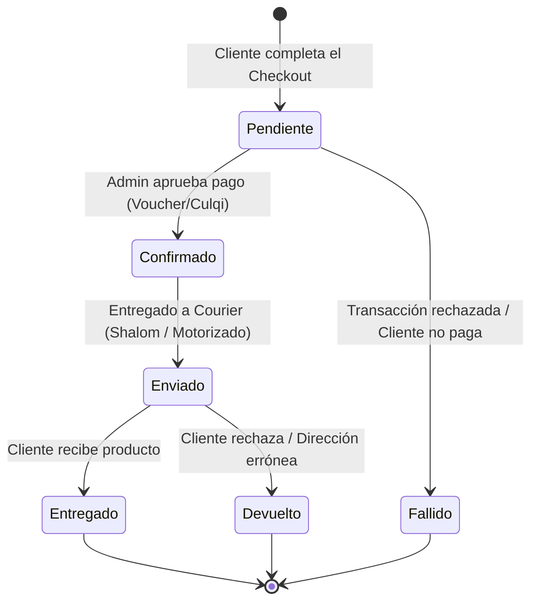

# Lógica de Negocio y Flujo de Operaciones

Este documento detalla cómo funciona la tienda a nivel comercial, enfocándose en la vida de un pedido, la gestión de pagos y la manipulación atómica de inventario.

## 📦 El Ciclo de Vida de un Pedido (Máquina de Estados)

Todo pedido ingresa al sistema y transita por un ciclo estrictamente controlado para evitar problemas logísticos.

## 🛡️ Seguridad Transaccional "Cero Confianza" (Zero-Trust)

La plataforma asume que cualquier dato enviado por el navegador del cliente puede estar manipulado o corrupto. Por lo tanto:

1. **Precios Invisibles:** En el carrito de compras, el cliente solo envía `[ProductoID, Cantidad, VarianteID]`. El servidor descarta cualquier precio subido por el cliente y consulta el precio original directamente en Postgres.
2. **Cálculo Robusto:** La función de backend `validateAndCalculateTotals` centraliza todas las validaciones de Subtotal, Flete y Cupones, siendo este el único monto oficial que se cobra en Culqi.

## 🔐 Descuento Atómico de Stock (El problema de concurrencia)

En E-commerce de alto tráfico, existe el riesgo de que dos personas compren el último artículo exactamente al mismo segundo. 

Para resolverlo, la tienda no usa lógica en React para descontar stock. Emplea un **Remote Procedure Call (RPC)** nativo en Supabase PostgreSQL llamado `admin_procesar_descuento_stock`.

### Flujo de Concurrencia:
1. El cliente paga.
2. El backend llama a Postgres.
3. Postgres hace un bloqueo a nivel de fila (*row-level lock*).
4. Verifica si hay `stock > 0`.
    - **Si hay:** Descuenta -1, guarda la venta y libera.
    - **Si NO hay:** Rechaza la operación de la base de datos y le notifica al cajero (Culqi) que anule/reverse el cobro de inmediato.

## 🏢 Jerarquía de Roles del Sistema

- **Cliente (Auth Público):** Puede crear pedidos, ver su historial de compras en `/checkout/success`.
- **Worker (Trabajador de Logística):** Puede acceder al panel administrativo, cambiar estados de *Confirmado* a *Enviado*, y ver pedidos que le hayan sido asignados específicamente. No puede ver balances de dinero de la empresa.
- **Admin / Superadmin:** Tienen acceso total. Pueden manipular la tabla de productos, asignar roles, reasignar pedidos, y exportar la data en Excel. Pueden realizar bloqueos masivos (Bulk Actions).
