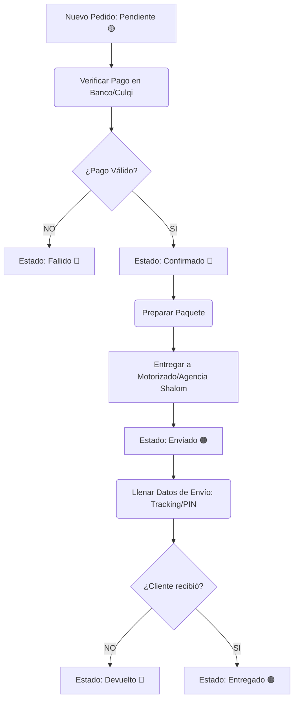

# 📘 Manual de Operaciones Administrativo

Bienvenido al panel administrativo de Tienda Blama. Esta es la guía rápida para tu gestión logística del día a día.

## 🔄 Flujo de Gestión Diaria

## 📦 Instrucciones Paso a Paso

### 1. Ingreso de Órdenes
- Ve al módulo **Pedidos**. Verás un punto verde parpadeando si acaba de ingresar uno nuevo en los últimos segundos.
- Haz clic en el ícono del **Ojo** para ver el detalle de un pedido en estado **🟡 Pendiente**.

### 2. Comprobación de Pagos
- Dirígete a la sección **"Comprobante / Pago"**. 
- Haz clic en "Ver Voucher" si el cliente pagó por Yape/Transferencia.
- Si el pago se refleja en tu cuenta bancaria, cambia el estado superior a **🔵 Confirmado**.

### 3. Envíos y Agencia Shalom
Si el pedido es para provincia, deberás llevarlo a Shalom. Al volver de la agencia es **OBLIGATORIO** rellenar la tarjeta de **Envío**:
- **Nº Orden:** El código numérico de Shalom.
- **Clave de Recojo (PIN):** Vital. El número que necesita el cliente para que le entreguen el paquete (Ej: 1234). Si la agencia no te dio uno, créalo tú y anótalo grande en la caja con plumón antes de enviarlo.

### 4. Entregas Parciales (Devoluciones Rápidas)
Si un cliente te compró 3 productos pero rechaza 1 al momento de la entrega:
- NO canceles toda la orden.
- En la tabla de productos del detalle del pedido, busca el producto que te devolvió.
- Haz clic en la flecha circular **(Devolver ↺)**.
- El sistema automáticamente descontará del subtotal el precio de esa prenda y retornará la unidad físicamente al sistema de almacén.

## ⚠️ Reglas y Seguridad

- **Seguridad Antifraude:** El sistema nunca te permitirá aprobar un pedido si el stock físico de la prenda ha llegado a `0`.
- **Bloqueo Histórico:** Por seguridad contable, los pedidos que llevan más de 3 días en estado *Entregado* o *Cancelado* se bloquean para edición. Si necesitas modificar uno muy antiguo, contacta al desarrollador base (Superadmin).
